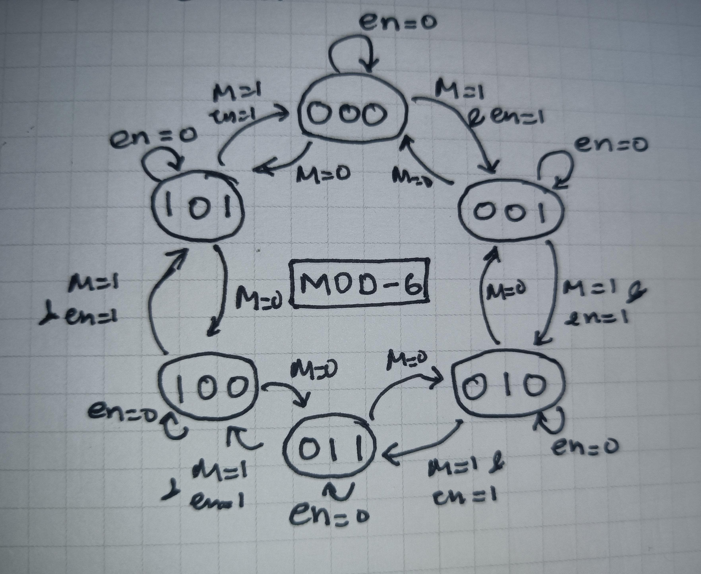
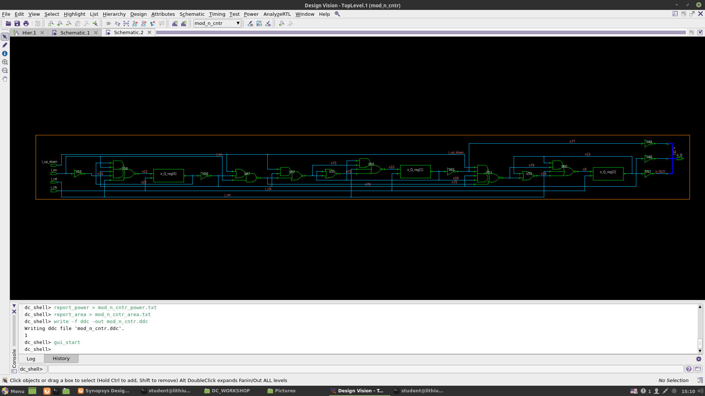

# RTL_TO_GDS2: Mod-N Conditional Up-Down Counter

This repository contains the RTL to GDS2 implementation of a Mod-N Conditional Up-Down Counter, a digital counter that counts up or down based on a control signal and wraps around after reaching a maximum count of N-1.

## Table of Contents

- [Introduction](#introduction)
- [Features](#features)
- [Block Diagram](#block-diagram)
- [Inputs and Outputs](#inputs-and-outputs)
- [Operation](#operation)
- [Timing Diagram](#timing-diagram)
- [State Diagram](#state-diagram)
- [Synthesis Results](#Synthesis-Results)
- [Applications](#applications)


## Introduction

The Mod-N Conditional Up-Down Counter is used in applications where counting within a specific range with directional control is required. It synchronizes with a clock signal, allows conditional counting based on an enable signal, and features reset functionality.

## Features

- Counts from 0 to N-1
- Up and down counting based on control signal
- Synchronous operation with a clock signal
- Conditional counting with an enable signal
- Reset functionality to initialize the counter

## Block Diagram

Include a block diagram of the counter here (or refer to an image if available).

## Inputs and Outputs

### Inputs
1. **Clock (i_clk):** Primary clock signal for synchronizing the counter.
2. **Reset (i_rst):** Asynchronous signal that resets the counter to 0 when asserted.
3. **Enable (i_en):** Enables counting when asserted. Holds the counter value when deasserted.
4. **Up/Down (i_up_down):** Control signal for counting direction:
   - High: Count up
   - Low: Count down

### Outputs
1. **Count (o_Q):** The current value of the counter, ranging from 0 to N-1.

## Operation

- **Counting Up:** When `i_up_down` is high and `i_en` is asserted, the counter increments on each rising clock edge.
- **Counting Down:** When `i_up_down` is low and `i_en` is asserted, the counter decrements on each rising clock edge.
- **Wrap Around:** 
  - Counting up: Counter wraps to 0 when reaching N-1.
  - Counting down: Counter wraps to N-1 when reaching 0.
- **Hold:** When `i_en` is deasserted, the counter holds its current value.
- **Reset:** Asserts to reset the counter to 0 asynchronously, overriding all other signals.
## State Diagram

**MOD_6**


## RTL Code:
**RTL Code**
```verilog
module mod_n_cntr # (parameter N = 6,  
     parameter WIDTH = 3)
   (input i_clk,
    input i_rst,
    input i_en,
    input i_up_down,
    output reg[WIDTH-1:0] o_Q
    );
    
always @ (posedge i_clk) begin  
    if (i_rst) begin  
      o_Q <= 0;  
    end 
    else begin  
     if (i_en) begin
      if (i_up_down) begin
        if (o_Q == N-1)
          o_Q<= 0;
        o_Q <= o_Q + 1; 
       end 
      else begin  
        if (o_Q == 0)
          o_Q<= N-1;
        o_Q <= o_Q - 1; 
        end
    end  
    end
end      

endmodule
```
[Test Bench](RTL/mod_n_cntr_tb.v)

## Constraints:

```sdc
create_clock -name my_clk -period 5 [get_ports i_clk]

set_clock_latency 1 my_clk

set_clock_uncertainty 0.1 my_clk

set_input_delay -max 0.5 -clock [get_clocks my_clk] [get_ports i_rst]
set_input_delay -max 0.5 -clock [get_clocks my_clk] [get_ports i_en]
set_input_delay -max 0.5 -clock [get_clocks my_clk] [get_ports i_up_down]

set_input_delay -min 0.125 -clock [get_clocks my_clk] [get_ports i_rst]
set_input_delay -min 0.125 -clock [get_clocks my_clk] [get_ports i_en]
set_input_delay -min 0.125 -clock [get_clocks my_clk] [get_ports i_up_down]

set_input_transition -max 0.1 [get_ports i_rst]
set_input_transition -max 0.1 [get_ports i_en]
set_input_transition -max 0.1 [get_ports i_up_down]

set_input_transition -min 0.05 [get_ports i_rst]
set_input_transition -min 0.05 [get_ports i_en]
set_input_transition -min 0.05 [get_ports i_up_down]

set_output_delay -max 0.5 -clock [get_clocks my_clk] [get_ports o_Q]
set_output_delay -min 0.125 -clock [get_clocks my_clk] [get_ports o_Q]

set_load -max 1 [get_ports o_Q];
set_load -min 0.5 [get_ports o_Q];
```

## Timing Diagram

Provide a timing diagram illustrating the counter's behavior during different operations.


## Synthesis Results

**Generated Block Diagram**


**Setup Time Analysis**
```txt
****************************************
Report : timing
        -path full
        -delay max
        -max_paths 1
Design : mod_n_cntr
Version: T-2022.03-SP5
Date   : Tue Aug 13 15:06:58 2024
****************************************

Operating Conditions: tt_025C_1v80   Library: sky130_fd_sc_hd__tt_025C_1v80
Wire Load Model Mode: top

  Startpoint: o_Q_reg[0] (rising edge-triggered flip-flop clocked by my_clk)
  Endpoint: o_Q[0] (output port clocked by my_clk)
  Path Group: my_clk
  Path Type: max

  Point                                                   Incr       Path
  --------------------------------------------------------------------------
  clock my_clk (rise edge)                                0.00       0.00
  clock network delay (ideal)                             1.00       1.00
  o_Q_reg[0]/CLK (sky130_fd_sc_hd__dfxtp_1)               0.00       1.00 r
  o_Q_reg[0]/Q (sky130_fd_sc_hd__dfxtp_1)                 0.30       1.30 r
  U56/Y (sky130_fd_sc_hd__clkinv_1)                       0.19       1.49 f
  U48/Y (sky130_fd_sc_hd__inv_8)                          1.11       2.60 r
  o_Q[0] (out)                                            0.00       2.60 r
  data arrival time                                                  2.60

  clock my_clk (rise edge)                                5.00       5.00
  clock network delay (ideal)                             1.00       6.00
  clock uncertainty                                      -0.10       5.90
  output external delay                                  -0.50       5.40
  data required time                                                 5.40
  --------------------------------------------------------------------------
  data required time                                                 5.40
  data arrival time                                                 -2.60
  --------------------------------------------------------------------------
  slack (MET)                                                        2.80
```
**Hold Time Analysis**
```txt
****************************************
Report : timing
        -path full
        -delay min
        -max_paths 1
Design : mod_n_cntr
Version: T-2022.03-SP5
Date   : Tue Aug 13 15:07:23 2024
****************************************

Operating Conditions: tt_025C_1v80   Library: sky130_fd_sc_hd__tt_025C_1v80
Wire Load Model Mode: top

  Startpoint: i_rst (input port clocked by my_clk)
  Endpoint: o_Q_reg[1] (rising edge-triggered flip-flop clocked by my_clk)
  Path Group: my_clk
  Path Type: min

  Point                                                   Incr       Path
  --------------------------------------------------------------------------
  clock my_clk (rise edge)                                0.00       0.00
  clock network delay (ideal)                             1.00       1.00
  input external delay                                    0.12       1.12 r
  i_rst (in)                                              0.00       1.12 r
  U50/Y (sky130_fd_sc_hd__a211oi_1)                       0.04       1.17 f
  o_Q_reg[1]/D (sky130_fd_sc_hd__dfxtp_1)                 0.00       1.17 f
  data arrival time                                                  1.17

  clock my_clk (rise edge)                                0.00       0.00
  clock network delay (ideal)                             1.00       1.00
  clock uncertainty                                       0.10       1.10
  o_Q_reg[1]/CLK (sky130_fd_sc_hd__dfxtp_1)               0.00       1.10 r
  library hold time                                      -0.06       1.04
  data required time                                                 1.04
  --------------------------------------------------------------------------
  data required time                                                 1.04
  data arrival time                                                 -1.17
  --------------------------------------------------------------------------
  slack (MET)                                                        0.12
```
[Area Report](Reports/mod_n_cntr_area.txt)

[Power Report](Reports/mod_n_cntr_power.txt)

[Netlist](Reports/mod_n_cntr_netlist.v)

## Applications

- Frequency Dividers
- Digital Clocks
- State Machines
- Event Counters


