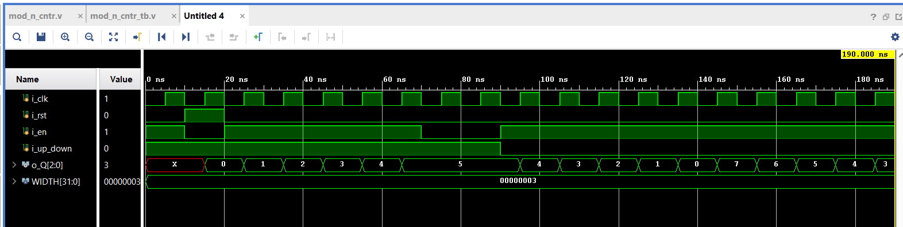

# RTL_TO_GDS2: Mod-N Conditional Up-Down Counter

This repository contains the RTL to GDS2 implementation of a Mod-N Conditional Up-Down Counter, a digital counter that counts up or down based on a control signal and wraps around after reaching a maximum count of N-1.

## Table of Contents

- [Introduction](#introduction)
- [Features](#features)
- [Block Diagram](#block-diagram)
- [Inputs and Outputs](#inputs-and-outputs)
- [Operation](#operation)
- [Timing Diagram](#timing-diagram)
- [State Diagram](#state-diagram)
- [Synthesis Results](#Synthesis-Results)
- [Applications](#applications)

## Introduction

The Mod-N Conditional Up-Down Counter is used in applications where counting within a specific range with directional control is required. It synchronizes with a clock signal, allows conditional counting based on an enable signal, and features reset functionality.

## Features

- Counts from 0 to N-1
- Up and down counting based on control signal
- Synchronous operation with a clock signal
- Conditional counting with an enable signal
- Reset functionality to initialize the counter

## Block Diagram

Include a block diagram of the counter here (or refer to an image if available).

## Inputs and Outputs

### Inputs
1. **Clock (i_clk):** Primary clock signal for synchronizing the counter.
2. **Reset (i_rst):** Asynchronous signal that resets the counter to 0 when asserted.
3. **Enable (i_en):** Enables counting when asserted. Holds the counter value when deasserted.
4. **Up/Down (i_up_down):** Control signal for counting direction:
   - High: Count up
   - Low: Count down

### Outputs
1. **Count (o_Q):** The current value of the counter, ranging from 0 to N-1.

## Operation

- **Counting Up:** When `i_up_down` is high and `i_en` is asserted, the counter increments on each rising clock edge.
- **Counting Down:** When `i_up_down` is low and `i_en` is asserted, the counter decrements on each rising clock edge.
- **Wrap Around:** 
  - Counting up: Counter wraps to 0 when reaching N-1.
  - Counting down: Counter wraps to N-1 when reaching 0.
- **Hold:** When `i_en` is deasserted, the counter holds its current value.
- **Reset:** Asserts to reset the counter to 0 asynchronously, overriding all other signals.

## Timing Diagram

Provide a timing diagram illustrating the counter's behavior during different operations.

## State Diagram

 

## Synthesis Results

## Applications

- Frequency Dividers
- Digital Clocks
- State Machines
- Event Counters

